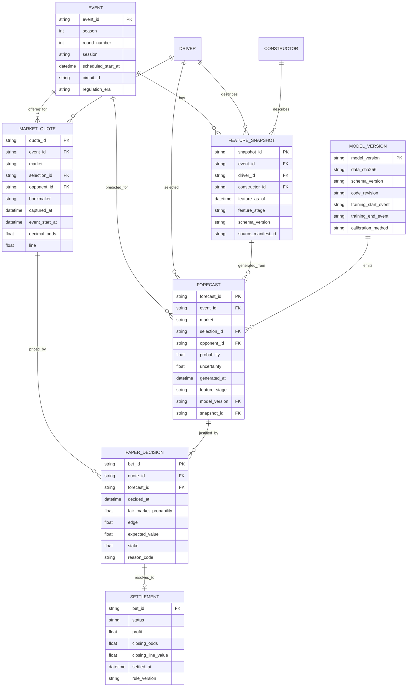

# F1 predictive betting data model v2

## Design goals

The v2 model is built around five rules:

1. Every observation has a stable event and entity identity.
2. Every feature and price has an availability timestamp.
3. Raw source data, engineered features, forecasts, prices, decisions, and settlements are separate facts.
4. Training reads only records available at the requested forecast stage.
5. Ledgers are append-only; corrections create a new version or explicit superseding record.

The existing 616-column analysis CSV remains supported as a legacy training artifact. Market history is not appended to that table because quotes are many-to-one over driver-race rows and change over time.

## Logical model



## Grain and primary keys

### Event

`event_id` uses `season-race_or_round-session`, for example `2026-belgium-R`. Session is included so qualifying, sprint, and race facts cannot collide.

Required uniqueness: one row per `event_id` in the event dimension.

### Feature snapshot

Grain: one driver × event × feature stage × snapshot version.

Required keys:

- `event_id`
- `resultsDriverId` or canonical `driver_id`
- `feature_stage`
- `feature_as_of`
- `schema_version`

The current core contract validates `event_id + resultsDriverId + feature_stage`. If multiple snapshots within one stage are retained, add `snapshot_id` to the key and define the selection policy, normally latest snapshot with `feature_as_of <= decision_time`.

### Market quote

Grain: one bookmaker offer for one selection, market, line, and capture instant.

`quote_id` is a deterministic hash of event, market, selection, opponent, bookmaker, and capture time unless the provider supplies a durable ID.

Never overwrite an opening quote with a closing quote. Both are facts.

### Forecast

Grain: one model version probability for one selection and market at one generation instant.

A head-to-head forecast must include `opponent_id`. An outright winner forecast does not.

### Paper decision

Grain: one evaluated quote/forecast pair. `stake=0` decisions may be retained in an audit table with a reason code, although the compact ledger currently records placed paper bets.

### Settlement

Grain: one settlement version per paper decision. A void is different from a loss. Book-specific rules must carry `rule_version`.

## Information stages

| Stage | Ordinal | Allowed examples | Forbidden examples |
|---|---:|---|---|
| `PRE_WEEKEND` | 0 | prior form, circuit, driver/team identity, announced upgrades | current FP/qualifying/race data |
| `POST_FP1` | 10 | FP1 pace and sectors | FP2, FP3, qualifying, race result |
| `POST_FP2` | 20 | FP1/FP2 long runs and weather | FP3, qualifying, race result |
| `POST_FP3` | 30 | all practice sessions | qualifying and race result |
| `POST_SPRINT` | 35 | completed sprint information | qualifying/race information not yet observed |
| `POST_QUALIFYING` | 40 | qualifying and provisional grid | later penalties not yet announced, race result |
| `PRE_RACE` | 50 | confirmed grid, forecast weather, latest price | first lap, incidents, final result |
| `LIVE` | 60 | observed lap/position/track status to the decision instant | future laps and final result |
| `POST_RACE` | 100 | classification, DNF, fastest lap, closing price | none for retrospective reporting; never use for a pre-race model |

`first_lap_position` is a live feature, not a pre-race feature. `closing_market_probability` is a post-decision evaluation field, not a production feature. These are explicitly registered as high leakage risk.

## Core contracts

Contracts live in `f1bet/contracts.py`.

### Race model snapshot

Required core columns:

- `event_id: string`
- `grandPrixYear: integer [1950, 2200]`
- `round: integer [0, 99]`
- `resultsDriverId: string`
- `constructorName: nullable string`
- `feature_as_of: UTC datetime`
- `feature_stage: SessionStage`
- `resultsStartingGridPositionNumber: nullable number [0, 40]`
- `resultsFinalPositionNumber: nullable number [1, 40]`, available only post-race

Extra legacy columns are allowed during migration.

### Odds ledger

Required columns:

`quote_id`, `event_id`, `market`, `selection_id`, nullable `opponent_id`, `bookmaker`, `captured_at`, `event_start_at`, `decimal_odds`, and nullable `line`.

Validation rejects duplicate quote IDs, invalid vocabularies, naive timestamps, and odds at or below 1.0.

### Forecast ledger

Required columns:

`forecast_id`, `event_id`, `market`, `selection_id`, nullable `opponent_id`, `probability`, `uncertainty`, `generated_at`, `stage`, `model_version`, and nullable `feature_snapshot_id`.

Probability and uncertainty must be in `[0, 1]`.

## Feature registry

Every production feature needs:

- a stable name;
- one or more raw sources;
- earliest availability stage;
- lookback in prior events, if temporal;
- a plain-language description;
- a leakage-risk classification.

The registry is code, not a spreadsheet, so training and inference can call `assert_available()` before selecting features. The Streamlit governance tab renders the same manifest.

## Identity dimensions

Provider display names are not keys. Maintain:

- canonical driver ID;
- canonical constructor ID plus chronology/effective dates;
- provider namespace and provider ID;
- normalized aliases;
- valid-from and valid-to dates;
- resolution status.

Ambiguous aliases fail closed. An unresolved bookmaker selection must be quarantined instead of fuzzy-matched into a bet.

## Raw snapshot envelope

`persist_raw_snapshot()` stores:

```json
{
  "source": "openf1",
  "captured_at": "2026-08-10T12:00:00+00:00",
  "request": {"endpoint": "laps", "session_key": 1234},
  "payload": []
}
```

Do not include API keys in `request` metadata. Raw files should be immutable and content-addressed in production.

## Model manifest

Each trained artifact should have a JSON manifest containing:

- model name/version and estimator;
- schema version;
- training start/end event;
- exact feature order;
- target;
- hyperparameters and random seed;
- dataset SHA-256;
- source-control revision;
- out-of-sample metrics;
- calibration method;
- notes and known limitations.

An artifact is not promotable if its dataset hash, schema, or feature order cannot be verified.

## Migration from the wide model

1. Read the legacy TSV.
2. Add `event_id` with `add_event_identity()`.
3. Stamp `feature_as_of`, `feature_stage`, and `schema_version`.
4. Deduplicate or explicitly model practice-session grain before enforcing the driver-event-stage key.
5. Build leakage-safe rolling features with `shift(1)`.
6. Convert wide market probability columns with `migrate_prediction_wide_to_forecasts()`.
7. Convert historical odds exports with `migrate_legacy_odds()`.
8. Validate normalized frames before appending them to ledgers.

The migration is additive. It does not delete or rewrite the existing model CSV.

## Storage recommendation

CSV remains supported for portability, but the long-term store should be SQLite/DuckDB locally and Parquet/object storage for immutable snapshots. F1DB's relational and versioned release model is a useful precedent. The normalized schema prevents the quote explosion and duplicate merge suffixes that a larger wide CSV would create.
