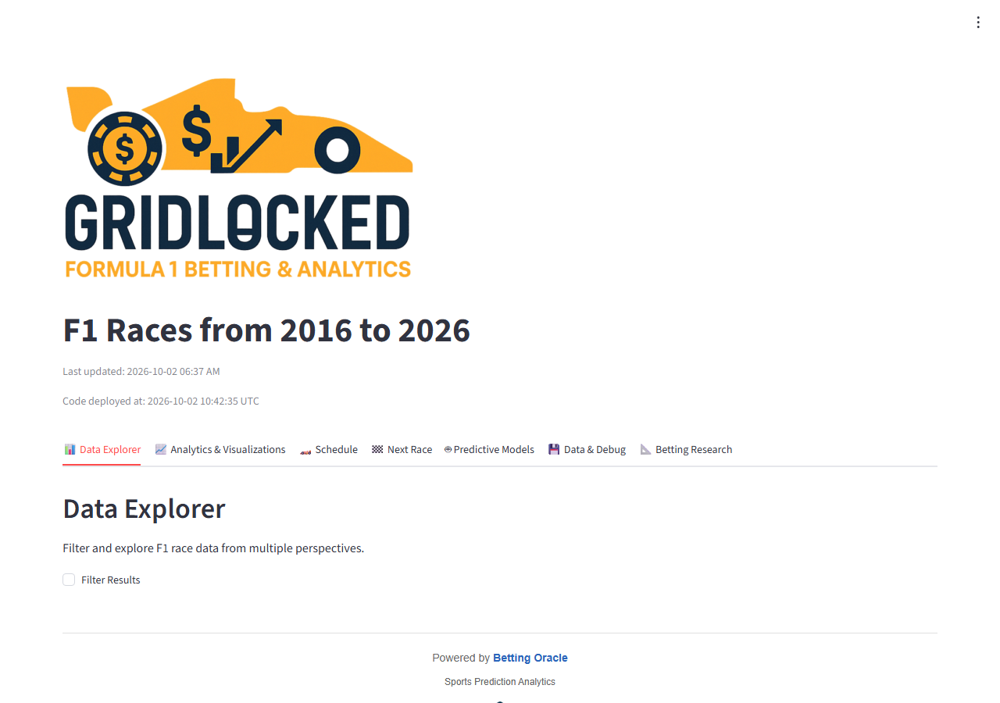
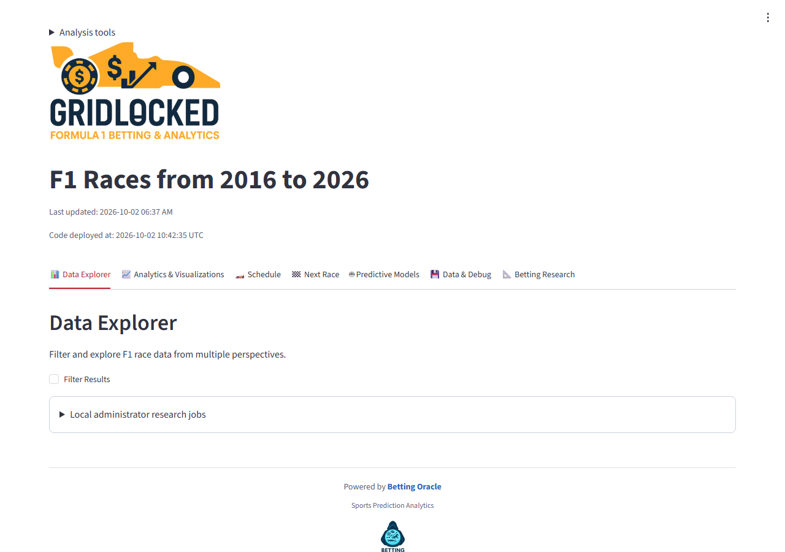
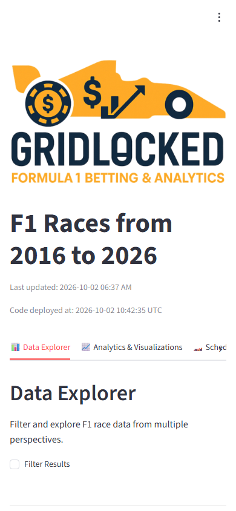
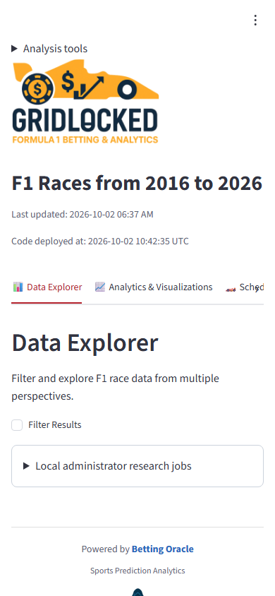

# Design proposals

The reference Streamlit layout remains the parity baseline. These proposals are optional changes to improve everyday use after conversion. The generated frontend exposes an **Analysis tools** drawer when `VITE_F1_ENHANCEMENTS=1`. **Improve readability** defaults off; enabling it applies `data-enhancements="on"` to the document root. Number and word typography continues to use Source Sans Pro, and years continue to display without thousands separators.

## D1 — Contrast, keyboard focus, and target sizes

**Reason.** The existing [accessibility evidence](../../parity_evidence/accessibility.json) recorded insufficient contrast for some captions and active navigation text. Pale secondary text makes dense numerical analysis harder to read.

**Behavior.** Remove reduced caption opacity. Use light-theme accent `#b4232d` and muted text `#596273`, and dark-theme accent `#ffb4ab` and muted text `#c5cbd7`. Add visible three-pixel focus outlines. Use 44-pixel minimum toolbar/button targets where this stylesheet controls them; preserve compact table data cells.

**Implementation.** [enhancements.css](code/frontend/enhancements.css), imported after the parity stylesheet in the supplied [main.jsx](code/frontend/main.jsx). Theme selectors distinguish light and dark modes and override the existing theme variables with sufficient specificity.

**Acceptance.** Check focus order, visible outlines, captions, nav selection, disabled controls, and both themes. Run the existing axe script after integration. WCAG AA generally requires 4.5:1 for ordinary text; 44-pixel targets are an additional usability choice, not a claim about the AA target-size requirement. The preview is not certified as WCAG conformant. [W3C contrast guidance](https://www.w3.org/WAI/WCAG22/Understanding/contrast-minimum.html).

## D2 — Compact branding and responsive navigation

**Reason.** Large branding and top spacing postpone the first useful table, especially on a phone. Dense horizontal tools also need deliberate mobile behavior.

**Behavior.** Keep the same branding image but cap its width at 280 pixels on desktop and 210 pixels on mobile. Use 40-pixel desktop top padding and 56 pixels on mobile, a 30-pixel mobile title, sticky section navigation, and narrower mobile sidebar spacing. Keep the same headings, filters, data, and theme.

**Implementation.** The optional CSS profile in [enhancements.css](code/frontend/enhancements.css). The profile does not rewrite the source view tree or change the analysis.

**Acceptance.** At 1280×900 and 390×844, ensure the title, navigation, filter controls, tables, and sidebar remain reachable without page-level horizontal overflow. Test both themes and zoom separately. Sticky controls reduce usable vertical space on small screens; disabling the readability profile restores the base layout.

## Actual desktop screenshots

The “current” images use the existing production bundle in a temporary local static preview. The “proposed” images use the separately built enhancement preview. Both are real Chromium captures, not generated mockups. The screenshot script proxies the same local API, but the views shown are examples rather than a pixel-diff parity test.

Existing desktop:

Proposed desktop, with readability enabled:

## Actual mobile screenshots

Existing mobile:

Proposed mobile, with readability enabled:

## D3 — Visible table and chart controls

**Reason.** Hover-only controls are difficult to discover and unreliable for touch and keyboard use. Users need to locate search, column selection, export, and display controls before interacting with a dense table.

**Behavior.** The profile makes existing table toolbars visible, increases control targets, and positions the column picker within the table area. The additional display selector offers **Data grid** and **Accessible table**. The grid remains the default, with its existing sorting, pinning, selection/copy, numeric formatting, fullscreen, and CSV export.

**Implementation.** [enhancements.css](code/frontend/enhancements.css) and [EnhancedTable.jsx](code/frontend/EnhancedTable.jsx). The original `ViewTable` supplies the grid behavior; the new component delegates to it unless the semantic mode is selected.

**Acceptance.** Open/close the column picker by keyboard and touch; check it does not obscure unrelated content. Confirm the original grid's exports and interactions still work. The semantic view provides its own search, columns, and paging, while the grid retains the richer spreadsheet-style controls.

## D4 — Loading, errors, and asynchronous chart cleanup

**Reason.** A blank or frozen-looking panel gives no indication that a large analysis is still running. Changing filters quickly can also deliver obsolete responses after the latest request.

**Behavior.** Display a polite loading status outside the `main[aria-busy]` region. Show elapsed seconds visually without announcing every increment. Keep a readable request failure state. A generation guard prevents stale rendering; AbortController releases requests no longer used by the current view. Default analysis requests time out after 120 seconds, action requests after 600 seconds.

**Implementation.** [LoadingFeedback in FeatureBar.jsx](code/frontend/FeatureBar.jsx), [viewClient.js](code/frontend/viewClient.js), and the effect cleanup in the supplied [App.jsx](code/frontend/App.jsx). [SafePlotlyChart.jsx](code/frontend/SafePlotlyChart.jsx) catches asynchronous chart errors, observes container resizing, and purges charts during disposal.

**Acceptance.** Rapidly change sections/filters, interrupt a slow request, and simulate an HTTP failure. Confirm the latest view wins and no stale chart updates occur after unmounting. Browser cancellation does not preempt Python already executing on the server. Timeouts are meaningful UI feedback, not server-side execution limits. See [React effect cleanup](https://react.dev/reference/react/useEffect) and [MDN AbortController](https://developer.mozilla.org/en-US/docs/Web/API/AbortController).

## Design integration and rollback

Use the [frontend copy map](04_FRONTEND_IMPLEMENTATION.md#copy-map) and review the complete files below it. Set `VITE_F1_ENHANCEMENTS=1` at build time to expose the tools. The profile remains a user choice. To return to the base interface, disable the readability checkbox; to remove the optional tools, rebuild with `VITE_F1_ENHANCEMENTS=0`. Asset optimization and lifecycle cleanup remain in the candidate files even with the UI flag off.
