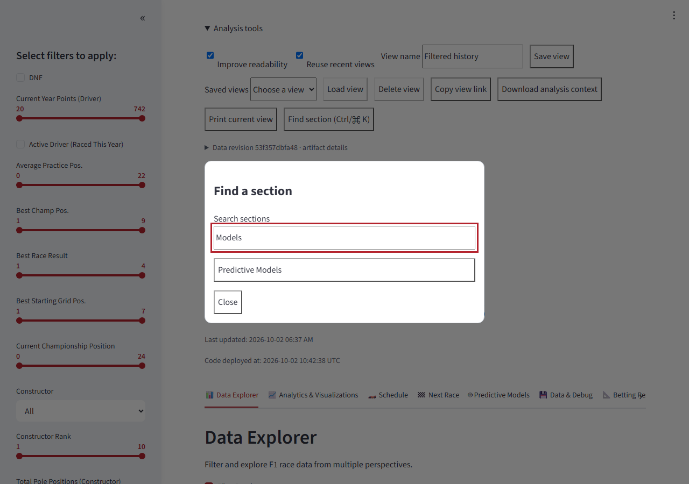
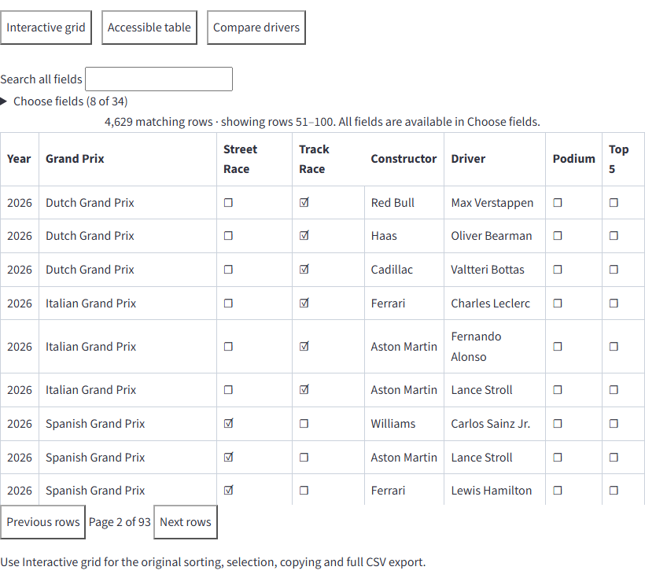
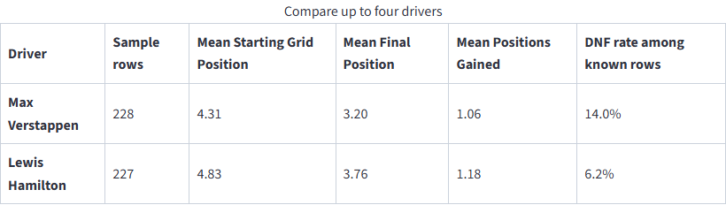
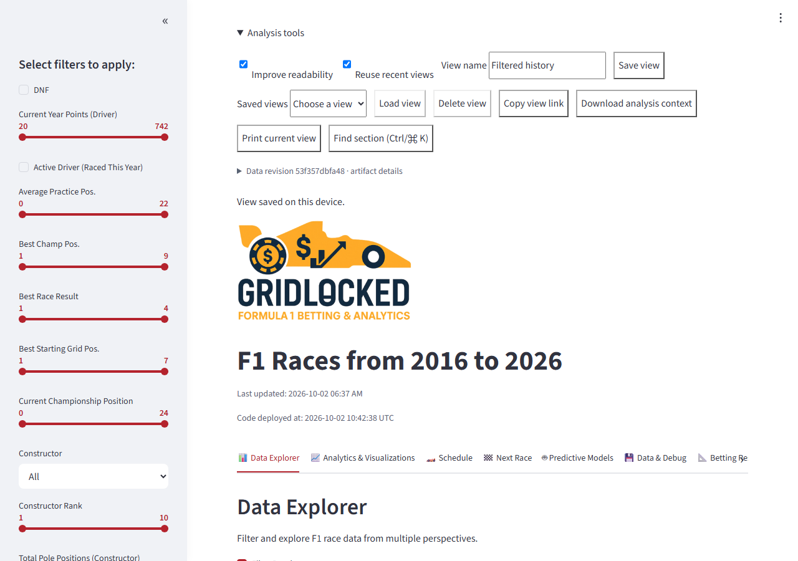

# Feature proposals

All features in this chapter have complete code in the [frontend appendix](04_FRONTEND_IMPLEMENTATION.md). The prototype uses the existing declarative views and calculations. It does not add new predictions, change the raw-data schema, or change current CSV formats.

## F1 — Named saved views

**User flow.** Open **Analysis tools**, enter a name, and save the current section and safe filter settings. Select a saved view to restore it, or delete it. Saving the same name replaces that entry.

**Implementation.** `preferences.js` uses versioned `f1analysis.saved-views.v1` local storage, at most 20 entries, and names limited to 80 characters. `FeatureBar.jsx` provides the controls; the supplied `App.jsx` restores the state and navigation together.

**Limits and checks.** Views belong to the current browser, not an account, and may disappear when browser storage is cleared. Uploaded data and betting/financial settings are excluded. Storage errors produce feedback rather than losing the current analysis. Tests cover validation and restoration; also check persistence after a normal reload and invalid/corrupt storage.

## F2 — Shareable analysis links

**User flow.** Choose **Copy link** to share a section with its selected safe settings. Opening it restores the encoded view before the initial request.

**Implementation.** A version-1 JSON object is encoded as Unicode-safe base64url in the hash query. Allowed values are `filter_results_main`, filter/range/checkbox keys, `_tabs:*`, model selection, and tire year/race selectors. Primitive arrays are limited to 20 items. The link token is limited to 6,000 characters. Invalid links fall back safely in the application.

**Limits and checks.** The token is readable; users should share only settings they intend to disclose. It omits uploads, ledgers, betting amounts, and administrator tokens. It records settings, not a frozen copy of the dataset: opening it against changed data can produce changed results. Test Unicode section/filter values, excluded keys, malformed tokens, old versions, oversized links, and reload behavior.

## F3 — Section search

**User flow.** Press Ctrl+K or Cmd+K, type part of a section name, and open a matching section. Escape closes the dialog.

**Implementation.** `FeatureBar.jsx` uses the native `dialog` element, filtered section buttons, and an Enter action. This searches section names, not every data value or chart label.

**Limits and checks.** Native focus handling supports modal behavior, but keyboard focus return and assistive technology behavior should still be checked in target browsers. Avoid overriding shortcuts while the dialog is being dismissed. The browser check covers searching and opening Predictive Models. [MDN dialog documentation](https://developer.mozilla.org/en-US/docs/Web/HTML/Reference/Elements/dialog).

## F4 — Semantic table mode

**User flow.** Choose **Accessible table** above a data grid. Search the table, choose columns, and move between 50-row pages. Switch to **Data grid** for the original spreadsheet-style interaction.

**Implementation.** `EnhancedTable.jsx` renders a real `table`, caption, column headers, and body cells. It starts with eight visible columns to keep a phone-sized table manageable. All supplied columns remain selectable, and search covers all fields in the underlying rows.

**Data guarantee.** Paging changes the displayed slice, not the API response or stored rows. The raw payload still contains 4,629×561 cells. Year formatting keeps years without grouping; numeric and textual cells inherit the same font. Existing column formatting metadata remains in use.

**Limits and checks.** Semantic mode does not duplicate every sorting/pinning feature of the grid. Wide column selections still need horizontal scrolling within the table. An all-field client search across a large table consumes CPU; assess it on the target phone hardware. Check captions, headers, page totals, empty searches, column selection, and screen-reader navigation. [W3C table guidance](https://www.w3.org/WAI/tutorials/tables/).

## F5 — Historical driver comparison

**User flow.** In a suitable driver table, open the comparison controls and select up to four drivers. Compare average start, finish, position gain, and DNF percentage over the current supplied table.

**Implementation.** `EnhancedTable.jsx` detects supported driver columns and calculates descriptive summaries from existing rows. It reports row sample counts and uses only known finish/status rows for the relevant denominators.

**Limits and checks.** The input may contain multiple rows per race, so the sample count is a row count, not a guaranteed unique-race count. The comparison reflects the current filtered table and any missing data. It is historical description, not a forecast, model confidence interval, or calibrated betting probability. Check empty selections, missing fields, unknown finish status, the four-driver cap, and deterministic results for a fixed table.

## F6 — Reproducibility context and printing

**User flow.** Choose **Export context** to download JSON describing the current analysis settings and source provenance. Existing CSV and chart downloads stay available. **Print current view** opens the browser print flow.

**Implementation.** `FeatureBar.jsx` requests `GET /api/enhancements/status` and exports safe settings, section/page, UTC export time, artifact revision, build revision, dataset modification time, and selected recorded model-manifest fields. Print styling hides unnecessary controls.

**Limits and checks.** The revision is based on file metadata rather than a content checksum; model fields are recorded manifest provenance, not independent verification of current model quality. Existing manifest notes about legacy finishing-position models and absent probability calibration must be preserved. Printing the semantic table prints its current page, not every raw row. Exporting context does not replace or reformat an existing CSV contract.

**Acceptance.** Validate the downloaded JSON schema, safe-key exclusion, model notes, revision and UTC time. Verify original CSV exports separately. The supplied browser test downloads and inspects the JSON.

## Feature defaults

Set `VITE_F1_ENHANCEMENTS=1` when building to expose these tools. The drawer starts collapsed; semantic mode is opt-in per table; readability and response caching default off. Named views are local to a browser. Section settings stored during the enhancement mode use the safe-key allowlist, so private uploaded content is not retained through that mechanism.

Research jobs are a separate optional administrator feature described in [B4](03_BACKEND.md#b4--isolated-local-research-jobs). They require the backend flag and a token; the token field never writes the token to saved views, share links, or browser storage.
