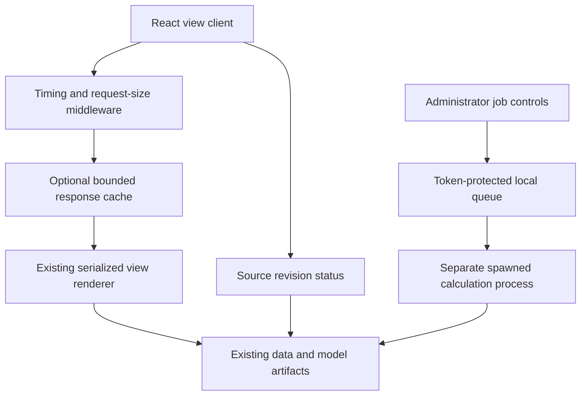

# Backend proposals

The completed serialization/compression change is the first performance improvement. These additional proposals focus on repeated work, stale-data correctness, operational visibility, and isolation of explicit research actions. The complete implementation appears in [05 — Backend implementation](05_BACKEND_IMPLEMENTATION.md).

## B1 — Bounded response reuse and request deduplication

**Reason.** Revisiting an unchanged section can repeat full Python rendering, JSON serialization, and gzip compression. A browser can also issue duplicate requests for the same view while effects are mounting.

**Server behavior.** With `F1_ENHANCEMENTS=1` and `F1_VIEW_RESPONSE_CACHE=1`, reuse only pages 1–5 with no action or uploaded/private structured values. Cache keys contain the complete values, page, and source revision. Retain at most 12 entries or 64 MiB across plain and gzip response bytes, with a 20-second TTL. Precompress gzip once per miss at level five; handle `gzip;q=0` correctly.

**Browser behavior.** The optional cache setting enables `viewClient.js`. It first requests the current revision on every reusable navigation, then reuses a matching response for up to 15 seconds. Limit storage to six entries and 12,000,000 serialized bytes. Concurrent identical reusable requests share one fetch; aborting one subscriber does not cancel another active subscriber.

**Exclusions.** Raw Data/page 6, Betting Research/page 7, actions, uploads, CSV and ledger keys bypass reuse. Actions clear retained responses. Upload/private value changes clear the client cache. Server responses keep `Cache-Control: no-store`: this is explicit application reuse, not a shared browser/proxy HTTP cache.

**Limits.** Server state is process-local. The browser budget estimates serialized data, not actual JS heap. A miss still needs the full rendering computation. Python view rendering is already serialized and the candidate keeps a guarded revision/render boundary; this cache does not make misses parallel. No cold-start speedup or throughput improvement is claimed without a load test.

**Acceptance.** Same settings hit; changed settings miss; artifact revision invalidates; TTL/byte/entry limits evict; private values bypass; actions invalidate; response content matches. The real API probe observed a cache HIT. Measure first visit and repeated visit separately before changing defaults.

## B2 — Revision identity and source-cache invalidation

**Reason.** Caching a response safely also requires detecting new data/model artifacts. Existing data loaders and presentation caches can otherwise keep old contents.

**Behavior.** `artifact_revision` scans eligible data/model and backend source paths, sizes, and nanosecond modification times. Poll at most once per second. When the fingerprint changes, clear presentation and data/analysis loader caches under the existing render lock, plus the response cache. Responses expose `X-F1-Revision`. The status route also exposes the revision for the client and context exports.

**Limits.** This is a metadata fingerprint, not a cryptographic content identity, despite using SHA-256 to summarize the inventory. Replacing content while deliberately retaining identical size/mtime can defeat it. Publish artifacts atomically with a changed mtime. Restart workers after code changes: fingerprinting Python files does not reload an already compiled view module. A file modified during a render can still require an operationally coordinated publish; the scan is not a database snapshot.

**Acceptance.** Change a sample artifact and confirm status revision and both cache layers change. Test CSV fallback and missing/unreadable manifests. Model manifests are exported as recorded provenance; recalculating every dataset/model content hash on every navigation would reintroduce avoidable work.

## B3 — Request timing, IDs, and bounded diagnostics

**Behavior.** Pure ASGI middleware attaches `X-Request-ID` and `Server-Timing: backend;dur=...` to responses. Retain 500 recent records containing route, status, time, and response-body bytes. Use structured request log lines and a token-protected metrics endpoint.

**Scope.** Middleware is installed outside the gzip layer, so header timing includes application processing and compression until response headers are sent. It excludes the network/browser and is not a breakdown of dataset load versus chart rendering versus JSON serialization. Byte counts describe emitted response bodies; on gzip responses these are compressed bytes.

**Privacy and logging.** Records do not include query strings, request bodies, headers, or tokens. Use the supplied `logging.json` through Uvicorn's `--log-config` option to enable INFO-level structured logs. Worker exception logs contain tracebacks and need normal server-log access controls.

**Acceptance.** Check the headers on success/failure, bounded record retention, request-ID uniqueness, and token restrictions. Detailed metrics require `F1_ADMIN_TOKEN`; status metadata remains a public local API response. See [MDN Server-Timing](https://developer.mozilla.org/en-US/docs/Web/HTTP/Reference/Headers/Server-Timing) and [Starlette middleware](https://starlette.dev/middleware/).

## B4 — Isolated local research jobs

**Reason.** An explicit audit or model bin comparison can run much longer than normal navigation. Executing it in the web process can block other analyses behind the same rendering lock.

**Behavior.** A one-thread coordinator submits work to a separate spawned calculation process with one worker. Expose only the existing **Bin Count Comparison** and **Temporal Leakage Audit** actions. Defaults are q=2 and 1,000 audit rows. The worker dispatches the original presentation action; it does not turn on general `F1_RESEARCH_MODE` or automatic training.

**Queue contract.** Retain at most eight jobs, input JSON below 64 KiB, plain results below 32 MiB, and compressed results for ten minutes after completion. Reject uploaded CSV/ledger/private structured inputs. Jobs pass through queued/running/succeeded/failed states. Queued jobs can be cancelled; a running calculation finishes. Status/result/delete requests require the same administrator token as submission.

**Correctness.** Pin the artifact revision at submission and check it in the worker. Changed artifacts cause failure and require resubmission. Clear worker source caches before executing. Bin q values must be integers 2–10, no more than nine values; audit rows must be 0–100,000, where zero means all source rows.

**Operational limits.** Use **one API worker and one instance** for this local implementation so polling reaches the process holding the job IDs. Jobs and results disappear on restart. The separate worker duplicates dataset/model memory. Graceful shutdown waits for running work; it does not provide a hard stop deadline. This is a bounded local queue, not a durable distributed worker system.

**Authorization boundary.** `F1_ADMIN_TOKEN` protects only the new job and metrics endpoints. Existing direct research actions retain their current behavior. The token input is held in React memory and never persisted; serve an authenticated/encrypted origin before exposing administrative controls outside a trusted local setup.

**Acceptance.** Unit checks exercise the actual spawned queue with a tiny importable test worker, successful results, failure, queue bounds, and cancellation. Dispatcher checks mock the expensive source actions and confirm the two allowed operations. No real retraining/bin experiment was executed for this proposal. Test the actual calculation separately in a controlled session before using it for a long run. [Python executor documentation](https://docs.python.org/3.13/library/concurrent.futures.html).

## B5 — Aggregate request-size limit

**Behavior.** With the backend enhancement flag enabled, the ASGI body limiter rejects request bodies exceeding 256 MiB before FastAPI JSON parsing. `F1_MAX_REQUEST_BYTES` changes the limit. The supplied Nginx configuration uses the aligned `client_max_body_size 256m` proxy cap.

**Compatibility.** The current frontend's individual-file 200 MB limit is unchanged. Several files or JSON escaping overhead can exceed the aggregate API limit even when each file individually passes the UI check. A rejected oversized body returns 413.

**Limits.** This buffers accepted bodies before parsing; choose a lower cap if the service memory cannot accommodate it. It protects the configured API process, not a complete ingress-denial-of-service strategy. Normal private uploads still bypass application caches.

**Acceptance.** Check accepted small bodies, over-limit payloads with and without Content-Length, and preserved request bytes. The module contract tests exercise the body limiter and the integrated service route tests cover its installation.

## Request architecture

The cache accelerates reuse; it does not reduce the underlying raw response fields. The isolated process removes research computation from the web process's rendering lock, while OS CPU/RAM remain shared resources.
