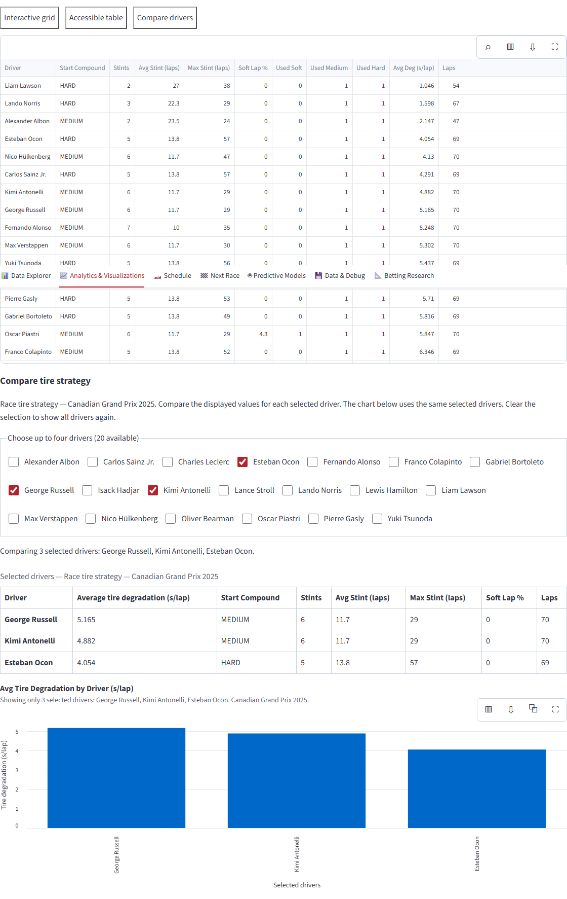
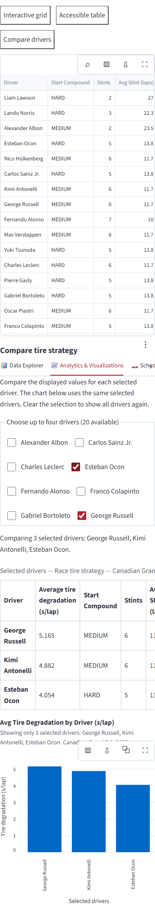

# Driver comparison acceptance

2026-10-04T11:43:00.589Z

- Passed: Real metrics and the selected-driver chart use the same three drivers
- Passed: Clear or close comparison restores the complete field
- Passed: Seasonal tire comparison uses the existing race counts and year scope
- Passed: Mobile comparison stays within the viewport

Unexpected errors: 0

Uses the live 2025 Canadian Grand Prix tire tables. Selected chart values are checked against the original unrounded source; table values retain their displayed rounding.

