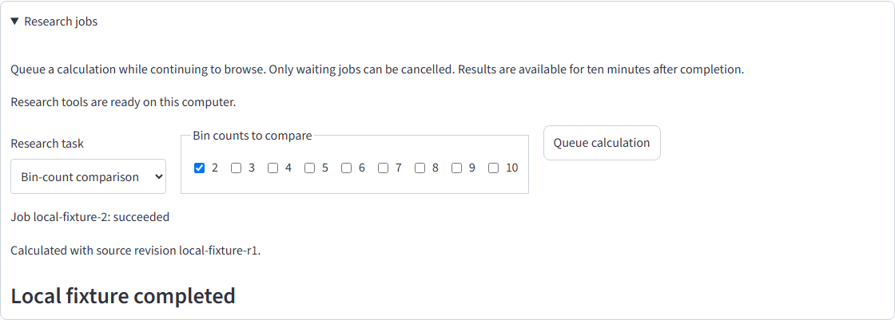

# Trusted local research acceptance

2026-10-03T22:04:24.091Z

- Passed: Live local access without credentials
- Passed: Local form, original action, queue, cancel, results and continued browsing

Unexpected browser or assertion errors: 0

Job lifecycle uses browser fixtures; server access checks and normal views use the running API. No real training was executed. Hosted authentication is covered by backend and hosted-form tests.

