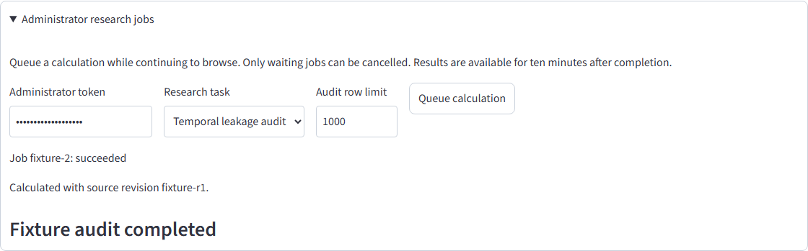
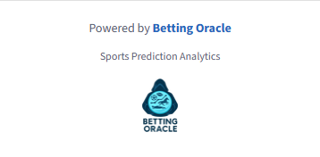

# Additional enhancement acceptance

2026-10-03T22:08:57.836Z

- Passed: B4 authorization and explicit synchronous-action guard
- Passed: B5 early aggregate rejection with diagnostic headers
- Passed: O2 enforced production entry budget and no source maps
- Passed: B4 browser submit, cancel, completion, output and token privacy
- Passed: O1 actual 1x and 2x footer assets at the original display size

Unexpected errors: 0

